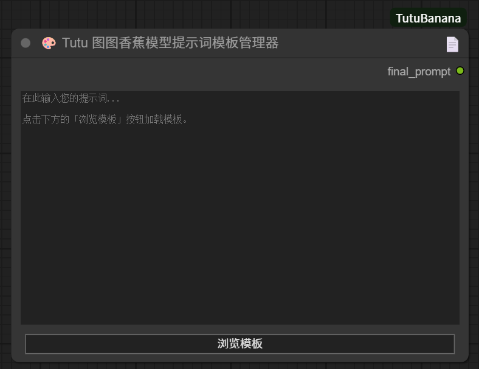
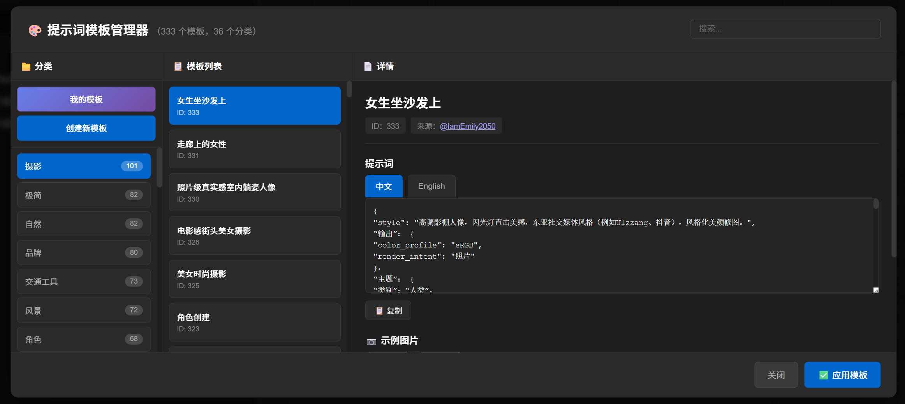
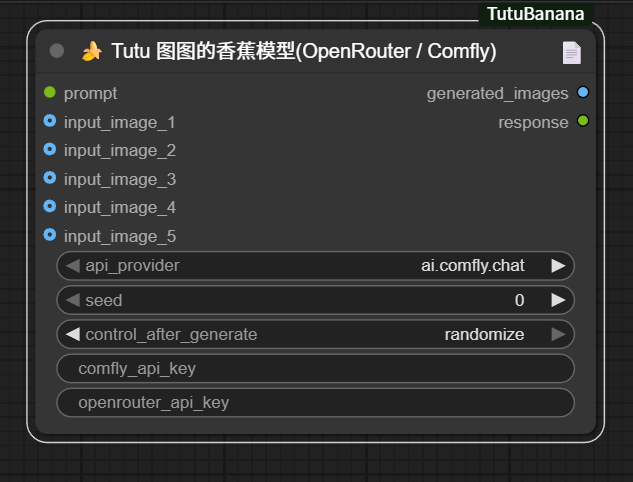
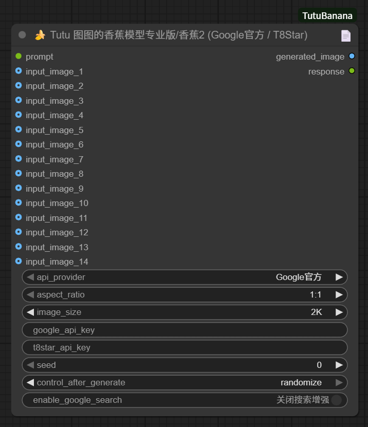

<div align="center">


# 🍌 ComfyUI-TutuBanana

**Professional Gemini Image Generation Node Suite for ComfyUI**

[](https://github.com/zhaotututu/ComfyUI-TutuBanana)
[](https://github.com/zhaotututu/ComfyUI-TutuBanana/issues)
[](LICENSE)
[](https://www.python.org/)

[English](#english-documentation) | [中文文档](README.md)

</div>

---

## English Documentation

### 📖 Project Overview

ComfyUI-TutuBanana is a powerful suite of custom nodes for ComfyUI, specifically designed for Google Gemini series model image generation. This project provides three core nodes covering the complete workflow from prompt template management to multi-platform API calls.

**Key Features:**

- 🎨 **Three Core Nodes**: Prompt Template Manager + Dual API Platform Support + Google Official API Pro
- 📚 **333 Professional Templates**: High-quality prompt templates across 10 categories with bilingual support
- 🖼️ **Multi-Image Processing**: Support up to 14 simultaneous image inputs for complex editing tasks
- 🌐 **Multi-Platform Compatible**: Supports OpenRouter, ai.comfly.chat, Google Official API, and T8Star
- 🔄 **Smart Index Mapping**: Automatically handles port number to API image index correspondence
- ⚡ **Random Variation Control**: Controllable randomness through seeds, supports "gacha" style generation

---

### 🎯 Three Core Nodes

#### 1️⃣ Prompt Template Manager

**Node Name:** `🎨 Tutu Prompt Template Manager`



**Features:**

- 📚 333 curated prompt templates built-in
- 🗂️ 10 major categories (Photography, Nature, Brand, Vehicles, Scenery, Characters, etc.)
- 🌍 Bilingual template support (Chinese/English)
- 🔍 Visual template browser with search and preview
- 💾 One-click template loading and application



**Use Cases:**

- Quick access to professional prompt inspiration
- Standardized prompt style
- Learn high-quality prompt writing methods

---

#### 2️⃣ Nano Banana (OpenRouter / Comfly)

**Node Name:** `🍌 Tutu Nano Banana (OpenRouter / Comfly)`



**Core Features:**

- 🌐 **Dual Platform Support**: OpenRouter and ai.comfly.chat
- 🎯 **Smart Model Selection**: Auto-matches model based on API provider
  - OpenRouter: `google/gemini-2.5-flash-image-preview`
  - Comfly: `gemini-2.5-flash-image-preview`
- 🖼️ **5 Image Inputs**: Support up to 5 reference images
- 🔢 **Auto Index Mapping**: Automatically converts port numbers to API image numbers
- 🎲 **Random Seed Control**: Reproducible randomness, supports "gacha" functionality

**Technical Features:**

- Base64 image encoding
- Automatic prompt enhancement (distinguishes text-to-image/image-to-image modes)
- Smart image labeling (`[这是图1]`, `[这是图2]`, etc.)
- Non-streaming API calls for better stability

**Input Ports:**

- `prompt` (force input): Prompt text
- `input_image_1~5` (optional): Reference images
- `api_provider`: API provider selection
- `seed`: Random seed (0 for completely random)
- `comfly_api_key` / `openrouter_api_key`: API keys

**Output Ports:**

- `generated_images`: Generated image tensor
- `response`: Detailed generation information

---

#### 3️⃣ Nano Banana Pro (Google Official / T8Star)

**Node Name:** `🍌 Tutu Nano Banana Pro (Google Official / T8Star)`



**Professional Features:**

- 🏢 **Google Official API Direct**: Uses official Gemini 3 Pro API
- 🎯 **T8Star API Support**: China-optimized API service
- 🖼️ **14 Image Inputs**: Professional multi-image processing capability
- 📐 **Precise Size Control**:
  - Aspect Ratio: 1:1, 2:3, 3:2, 3:4, 4:3, 4:5, 5:4, 9:16, 16:9, 21:9
  - Resolution: 1K, 2K, 4K
- 🔍 **Google Search Enhancement**: Enable online search capability (Google only, allowing the model to retrieve real-time information such as tomorrow's weather and date for more accurate results)
- 🎲 **Smart Image Selection**: Automatically selects highest resolution output

**Input Ports:**

- `prompt` (force input): Prompt text
- `input_image_1~14` (optional): Reference images
- `api_provider`: Google Official / T8Star
- `aspect_ratio`: Aspect ratio selection
- `image_size`: Resolution level
- `seed`: Random seed
- `enable_google_search`: Enable search enhancement (Google only)
- `google_api_key` / `t8star_api_key`: API keys

**Output Ports:**

- `generated_image`: Highest quality generated image
- `response`: Detailed generation report

---

### 🚀 Quick Start

#### Installation

**Method 1: Install via ComfyUI Manager (Recommended)**

1. Open ComfyUI Manager
2. Search for `TutuBanana`
3. Click install and restart ComfyUI

**Method 2: Git Clone Installation**

```bash
cd ComfyUI/custom_nodes
git clone https://github.com/zhaotututu/ComfyUI-TutuBanana.git
cd ComfyUI-TutuBanana
pip install -r requirements.txt
```

**Method 3: Manual Download**

1. Download ZIP: [GitHub Releases](https://github.com/zhaotututu/ComfyUI-TutuBanana/releases)
2. Extract to `ComfyUI/custom_nodes/ComfyUI-TutuBanana`
3. Install dependencies: `pip install -r requirements.txt`
4. Restart ComfyUI

---

#### API Key Configuration

**Method 1: Input Directly in Node (Recommended)**

- Fill in the corresponding API key input box in the node
- Automatically saves to configuration file

**Method 2: Edit Configuration File**

Create or edit `Tutuapi.json`:

```json
{
  "comfly_api_key": "your_comfly_api_key_here",
  "openrouter_api_key": "your_openrouter_api_key_here",
  "google_api_key": "your_google_api_key_here",
  "t8star_api_key": "your_t8star_api_key_here"
}
```

**Get API Keys:**

- **OpenRouter**: [https://openrouter.ai](https://openrouter.ai)
- **ai.comfly.chat**: [https://ai.comfly.chat](https://ai.comfly.chat)
- **Google Official**: [https://aistudio.google.com/apikey](https://aistudio.google.com/apikey)
- **T8Star**: [https://ai.t8star.cn](https://ai.t8star.cn)

---

### 📊 Use Cases & Workflows

#### Scenario 1: Pure Text-to-Image Generation

```
[Prompt Template Manager] → [Nano Banana] → Generate Image
```

1. Select a suitable template from the Template Manager
2. Connect the template output to Nano Banana's prompt input
3. Don't connect any image inputs
4. Run to generate

#### Scenario 2: Single Image Edit/Style Transfer

```
[Load Image] → input_image_1
[Prompt] → prompt
[Nano Banana] → Generate edited image
```

#### Scenario 3: Multi-Image Composition

```
[Image1] → input_image_1
[Image2] → input_image_2
[Image3] → input_image_3
[Prompt: Place the person from image1 in the background of image2, using the style of image3] → prompt
[Nano Banana] → Generate composite image
```

#### Scenario 4: Professional HD Output

```
[Prompt Template Manager] → [Nano Banana Pro]
Select:
- Resolution: 4K
- Aspect Ratio: 16:9
- Google Official API
→ Generate ultra-HD image
```

---

### 🎯 Advanced Tips

#### 1. Automatic Image Index Mapping

**Scenario:**
Suppose you only connected `input_image_2` and `input_image_5`

**✅ You can write like this:**

```
Combine the cat from image2 with the dog from image5
```

**✅ Or write like this:**

```
Combine the cat from image1 with the dog from image2
```

**Reason:** The node automatically maps connected ports to sequential image numbers. The system auto-converts:

- `input_image_2` (port 2) → `image1` (1st image in API)
- `input_image_5` (port 5) → `image2` (2nd image in API)

**💡 Best Practice:**

- Use sequential numbering starting from 1: `image1`, `image2`, `image3`...
- Supports multiple expressions: `imageX`, `pictureX`, `the Xth image`
- System automatically handles port number to actual image position mapping

---

#### 2. Using Random Seeds

**`seed = 0` (default)**

- Generates completely different results each run
- Suitable for "gacha" style exploration
- Adds random identifier to prompt each time

**`seed = Fixed value (e.g., 12345)`**

- Same prompt + seed generates similar (but not identical) results
- Suitable for fine-tuning and iteration
- Generates deterministic random variation based on seed

**Example:**

```
seed = 0  → variation-53921
seed = 0  → variation-78432  (completely different)
seed = 42 → variation-67834
seed = 42 → variation-67834  (same each time)
```

---

#### 3. Template System Usage Tips

**Browse and Search:**

- Click the "Browse Templates" button on the node to open the Template Manager
- Filter categories using the left sidebar
- Quick search with the search box in the upper right
- View sample images to understand effects

**Apply Templates:**

1. After selecting a template, the prompt will automatically load into the input box
2. Can use directly or edit further
3. The `{prompt}` placeholder in templates will be replaced with actual content

**Custom Templates:**

- Click "Create New Template"
- Enter name, category, prompt content
- Find it in "My Templates" after saving

---

### 🔧 System Requirements

**Runtime Environment:**

- **ComfyUI**: Latest version
- **Python**: 3.8+ (recommended 3.10+)
- **OS**: Windows / macOS / Linux

**Core Dependencies:**

```
aiohttp              # Async HTTP client
aiohttp-cors         # CORS support
GitPython           # Git integration
numpy               # Numerical computing
Pillow              # Image processing
requests            # HTTP requests
torch               # PyTorch framework
transformers        # Hugging Face library
huggingface-hub     # Hub integration
psutil              # System monitoring
matrix-client       # Matrix protocol
```

---

### ❓ FAQ

#### Q1: Why isn't my image being generated?

**A:** Check:

1. API key is correct
2. Network connection is stable
3. API balance is sufficient
4. Prompt explicitly includes image generation instruction
5. Check console logs for detailed errors

#### Q2: How to get better generation quality?

**A:** Suggestions:

1. Use Nano Banana Pro (supports higher resolution)
2. Select 4K resolution
3. Use professional templates from Template Manager
4. Provide clear, specific descriptions
5. For realism, add keywords like "photorealistic", "high quality"

#### Q3: How to use image numbers in prompts?

**A:**

- **Always start from 1**: `image1`, `image2`, `image3`...
- **Don't use port numbers**: Even if connected to `input_image_3`, write "image1"
- System auto-maps port numbers to sequential image numbers

#### Q4: What's the difference between OpenRouter and Comfly?

**A:**

- **OpenRouter**: International service, supports multiple model routing, standard OpenAI format
- **Comfly**: China-optimized, faster access, user-friendly interface

### 📚 Tutorials & Resources

**Video Tutorials:**

- 📺 **Bilibili**: [@zhaotutu](https://space.bilibili.com/431046154) - Detailed tutorials, workflow demonstrations
- 📺 **YouTube**: [@zhaotutu](https://www.youtube.com/@zhaotutu) - English tutorials and case sharing

**Workflow Downloads:**

- 🔗 [RunningHub](https://www.runninghub.ai/user-center/1936823199386537986/webapp?inviteCode=rh-v0990) - Download companion workflows and cases

**Community Support:**

- 💬 [GitHub Issues](https://github.com/zhaotututu/ComfyUI-TutuBanana/issues) - Bug reports and feature suggestions
- 📖 [GitHub Wiki](https://github.com/zhaotututu/ComfyUI-TutuBanana/wiki) - Detailed documentation and tutorials

---

### 📝 Changelog

#### v2.0 (Current - Major Update)

- ✨ Added Prompt Template Manager (333 professional templates)
- ✨ Added Nano Banana Pro (Google Official API + T8Star support)
- 🔄 Refactored image index mapping system (auto port conversion)
- 🎲 Added random seed control (reproducible randomness)
- 🖼️ Extended image inputs (5→14 channels)
- 📐 Added precise size control (aspect ratio + resolution levels)
- 🔍 Google Search enhancement support
- 🌐 Optimized multi-platform API compatibility

#### v1.1

- 🔧 Fixed node name conflicts
- 🖼️ Unified base64 image processing
- 🎨 Eliminated image white border issues
- ⚡ Improved OpenRouter compatibility

#### v1.0

- 🎉 Initial release
- 🌐 Multi-platform API support
- 📦 Basic preset system
- 📡 Streaming response support

---

### 🤝 Contributing & Acknowledgments

**Referenced Projects:**

- [Comfyui_Comfly](https://github.com/ainewsto/Comfyui_Comfly) - Thanks to the original author for excellent work

---

### 📄 License

This project is licensed under Apache-2.0. See [LICENSE](LICENSE) for details.

---

### 📞 Contact

- **GitHub**: [@zhaotututu](https://github.com/zhaotututu)
- **Bilibili**: [@zhaotutu](https://space.bilibili.com/431046154)
- **YouTube**: [@zhaotutu](https://www.youtube.com/@zhaotutu)

---

<div align="center">

**If you find this project helpful, please give it a ⭐️!**

Made with ❤️ by AI LAB Tutu

</div>

